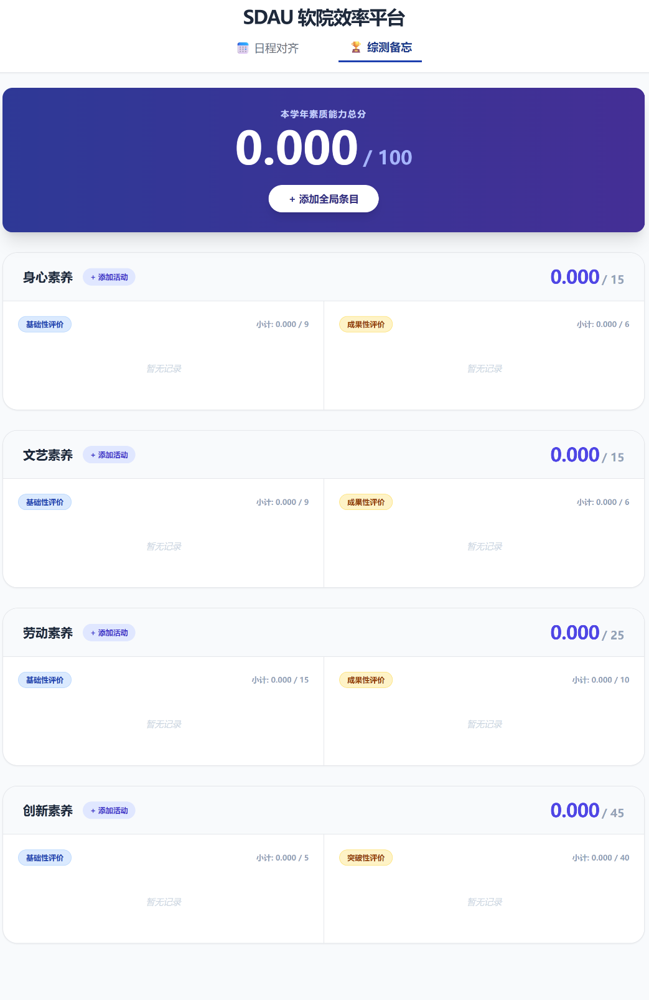
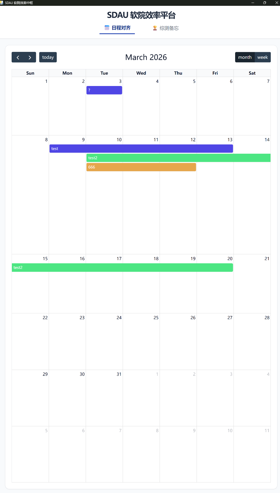

# SDAU 软院效率中枢 (SDAU Software Efficiency Hub)

🚀 **专为山东大学软件学院学子量身定制的桌面级效率管理终端。**

本工具旨在解决软院学子在**科研实验记录**、**复杂综测分数管理**以及**学术排期**中的实际痛点。拒绝繁琐的 Excel 表格，回归极简、私密的本地化管理。


---

## 🌟 核心特性

### 1. 深度定制的综测管理系统 (Comprehensive Assessment)
针对学院最新的素质能力评价办法，预设四大核心模块：
* **身心/文艺/劳动素养**：自动计算基础性评价与成果性评价，支持**成果分累加逻辑**。
* **创新素养**：专为科研党设计的突破性评价入口，支持 ICASSP/CVPR 等顶级会议/期刊加分记录。
* **精度保证**：计算精度严格对齐官方要求的 $0.001$ 分，彻底告别手动算分误差。
* **证明材料存档**：支持一键上传加分证明图片，本地化存储，导出时不再翻找聊天记录。

### 综测管理界面


### 2. 科研级日程对齐 (Academic Scheduler)
不同于普通的 Todo 软件，本项目支持：
* **多行文本展示**：专为记录“模型局限性”、“实验失败分析”等长文本设计，日历视图一目了然。
* **自定义调色盘**：自由标记任务紧急程度（红色：高优实验；蓝色：日常课程；绿色：已完成）。
* **拖拽交互**：支持在日历上直接拖拽调整进度，适配科研节奏的快速变动。

### 日程对齐界面


### 3. 数据安全与隐私
* **100% 本地化**：基于 SQLite 数据库，所有数据均存储在你的电脑本地，无需担心隐私泄露。
* **无感运行**：封装为原生 `.exe`，双击即用，不占用浏览器标签页。

---

## 🛠️ 技术架构

本软件基于现代全栈技术栈构建，确保了流畅的桌面交互体验：

* **后端**: Python (FastAPI) - 高性能异步接口处理
* **前端**: HTML5 + Tailwind CSS + Vanilla JS - 精致的响应式布局
* **容器**: PyWebView - 轻量级原生窗口封装
* **打包**: PyInstaller - 静态资源与环境深度整合

---

## 📥 安装与运行

### 方式 A：直接运行（推荐）
1.  下载最新的 `main.exe`。
2.  将其放入一个独立的文件夹（建议路径：`D:\EfficiencyHub`）。
3.  **双击运行即可。** * *注：软件运行后会自动在同级目录下生成 `todo_calendar.db` (数据库) 和 `uploads` (图片文件夹)，请勿删除。*

### 方式 B：源码调试
```bash
git clone [项目地址]
pip install -r requirements.txt
python main.py
```

---

## ❓ 常见问题 (FAQ)

**Q: 为什么我发给同学，他在手机上打不开？**
A: 本软件是专为 **PC 端生产力场景**设计的 `.exe` 可执行文件。它需要高性能的 CPU（如 i5-14600KF 同级或以上）和桌面操作系统来支撑复杂的科研逻辑和数据计算。**Android/iOS 暂不属于其“应用场景”。**

**Q: 运行时提示端口占用怎么办？**
A: 本版本已针对兼容性优化，采用了冷门随机端口。如仍有冲突，请重启尝试。

**Q: 软件打开是空白页？**
A: 请确保你的电脑已安装 **Microsoft Edge WebView2 Runtime**（现代 Win10/Win11 已默认内置）。

---

## 👨‍💻 开发初衷

在软院，我们每天都在处理各种复杂的模型和海量的数据。与其把精力浪费在核对那几分综测分和混乱的日程里，不如用代码把它们自动化。**以此工具，致敬每一位在保研、科研路上奋斗的软院学子。**
