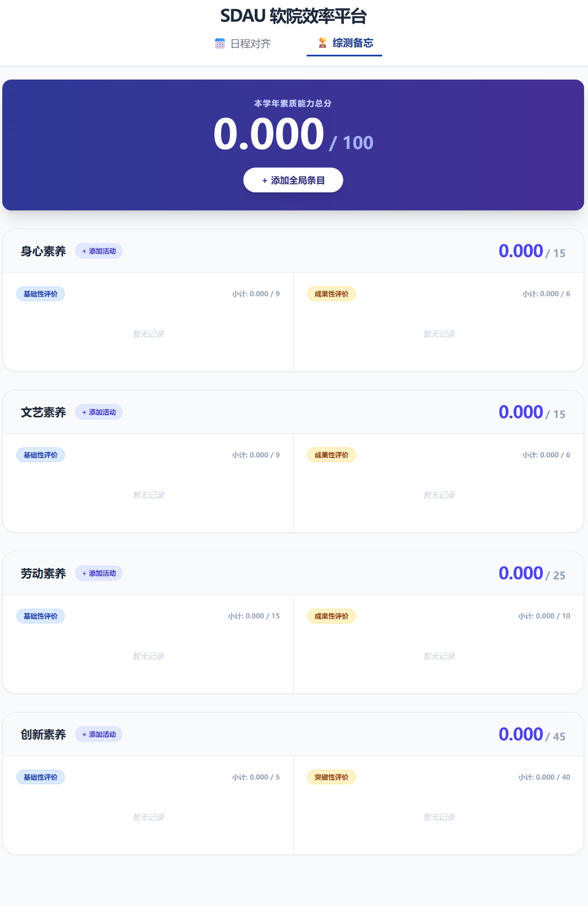
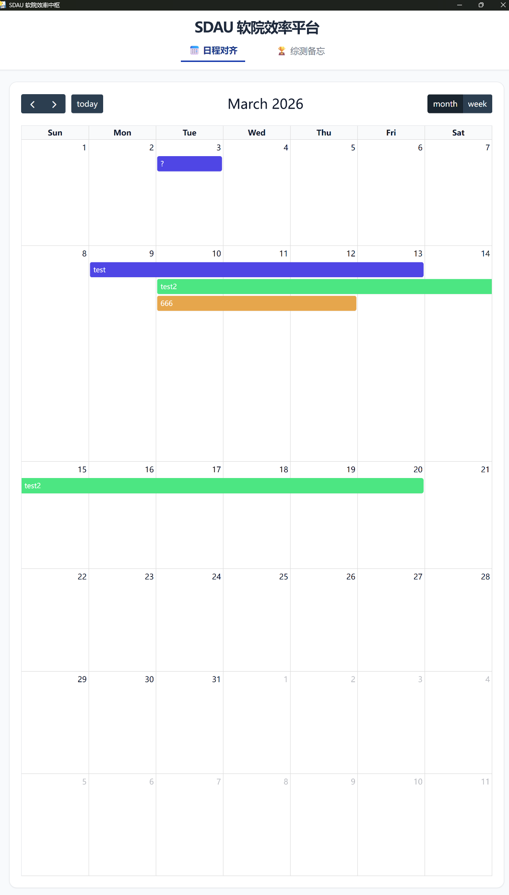

# SDU 软院效率中枢

面向山东大学软件学院学生的本地效率工具，用来管理综测记录、证明材料和日程安排。

<div align="center">

  <br />

  <a href="./SDU软院效率中枢.dmg">
    
  </a>
  &nbsp;
  <a href="./SDU软院效率中枢.exe">
    
  </a>
  &nbsp;
  <a href="./main.py">
    
  </a>

  <br />
  <br />

  <strong>macOS 下载 DMG，Windows 下载 EXE。数据只保存在本机。</strong>

</div>

---

## 预览

### 综测记录

记录身心、文艺、劳动、创新等模块的加分项，自动汇总分数，并保存证明材料。



### 日程管理

用日历管理课程、科研、ddl 和临时任务，支持拖拽调整与自定义颜色。



---

## 下载与运行

### macOS

下载 `SDU软院效率中枢.dmg`，打开后把 App 拖入 Applications。

### Windows

下载 `SDU软院效率中枢.exe`，双击运行。

### Python 源码

```bash
pip install -r requirements.txt
python main.py
```

运行后会在本机生成数据库和上传文件夹，用于保存你的记录和证明材料。

---

## 适合谁

- 想集中管理综测加分项和证明材料
- 想把课程、科研、ddl 放进一个本地日历
- 不想把个人材料传到在线表格或云端工具
